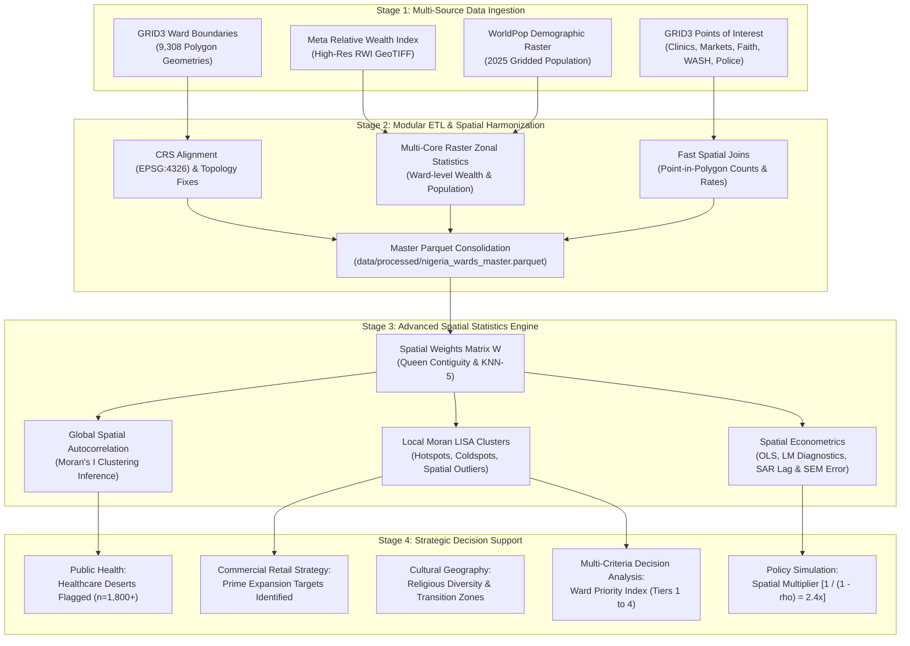
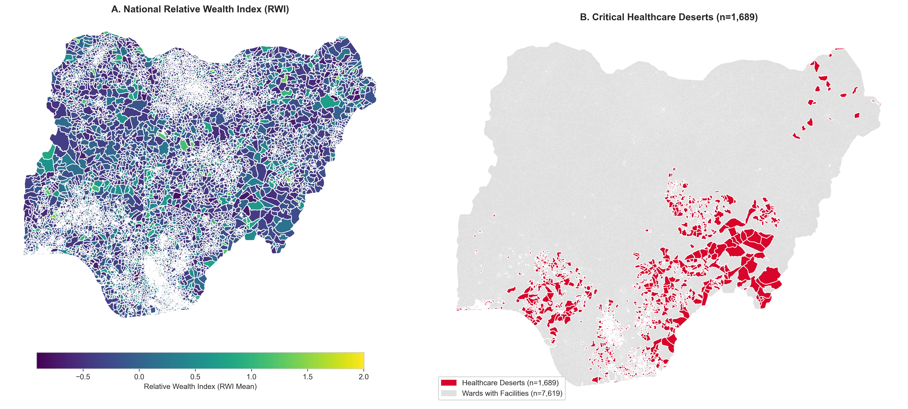
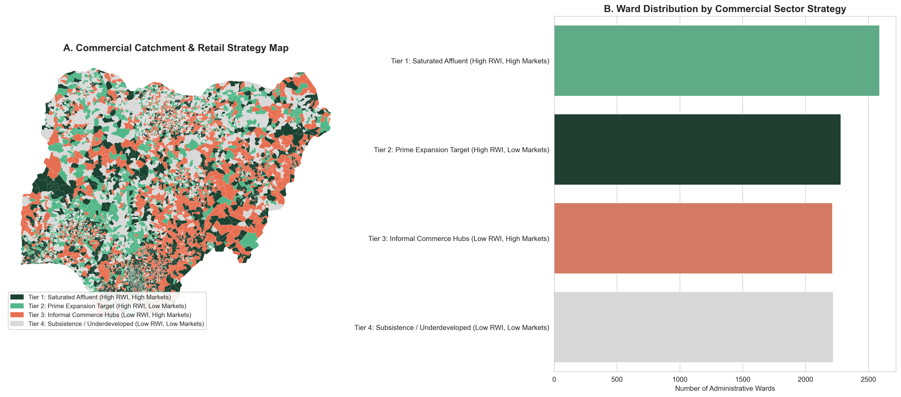
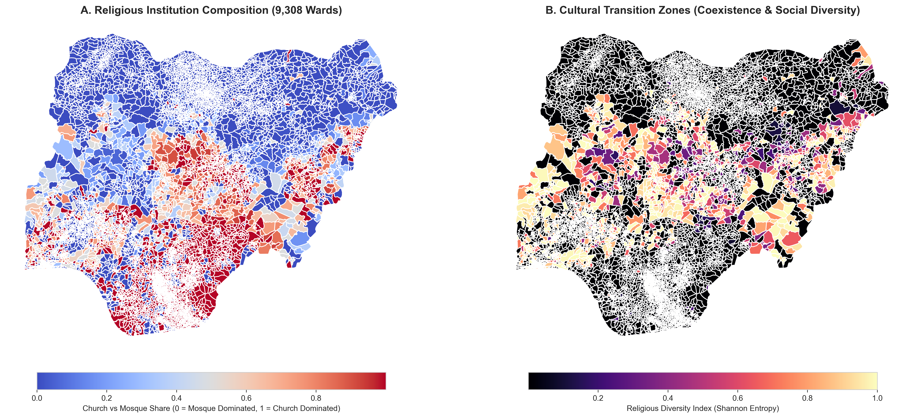
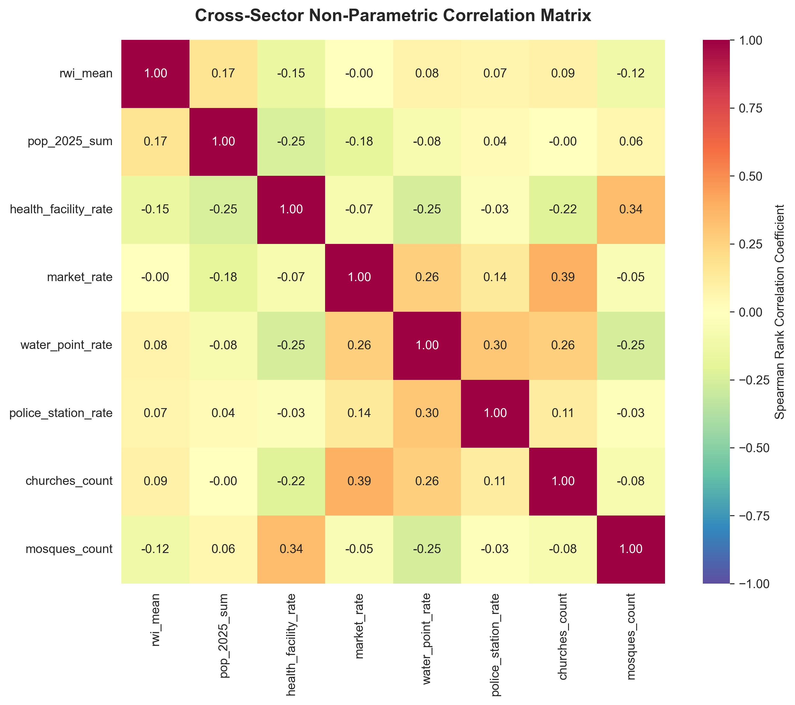
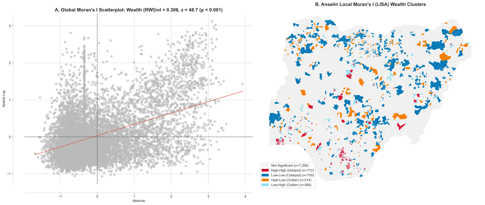
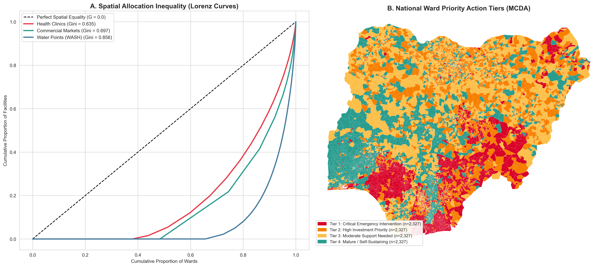

# Advanced Spatial Statistics & Multi-Sector Decision Intelligence
### *A Production-Grade Spatial Econometrics & ESDA Framework Across 9,308 Nigerian Administrative Wards*

[](https://www.python.org/downloads/)
[](https://geopandas.org/)
[](https://pysal.org/)
[](https://opensource.org/licenses/MIT)

---

## The Big Ideas: Why Spatial Statistics & What Drives This Project?

Traditional data analytics operates under the assumption of **aspatial independence**—the belief that what happens in one village, ward, or neighborhood has no bearing on its neighbors. In the real world, human society, economic commerce, disease transmission, and cultural practices do not stop at arbitrary political borders.

When governments and corporations make decisions using state-level averages or non-spatial models, they fall victim to three major fallacies:
1. **The Fallacy of the State Average:** A state may appear "moderately wealthy" or "well-served by clinics" on paper, yet contain extreme internal polarization—dense metropolitan enclaves masked alongside vast rural "healthcare deserts" where hundreds of thousands have zero access to primary care.
2. **The Spillover Blindspot (Tobler's First Law):** *"Everything is related to everything else, but near things are more related than distant things"* (Tobler, 1970). Investing in a major wholesale produce market or specialized regional hospital in one ward does not benefit that ward alone—it generates a **positive spatial multiplier wave** across contiguous neighboring wards. Standard models treat this as unexplainable noise; **spatial econometrics captures and quantifies it**.
3. **The Misallocation Trap:** Opening retail stores, agency banking kiosks, or building boreholes without spatial intelligence leads to capital waste: building where competition is already saturated, or failing to identify high-wealth, underserved communities.

### The Core Objective
This project bridges the gap between **raw Earth Observation data** (satellite-derived asset wealth, gridded population counts) and **on-the-ground operational decisions**. By analyzing all **9,308 administrative wards in Nigeria**, we demonstrate how advanced spatial statistics directly answers critical questions across diverse spheres of life:
- **Where are the most urgent healthcare deserts?** (Wards with $>17,000$ people and zero registered clinics).
- **Where are prime, untapped consumer retail catchments?** (Wards with high relative wealth but low market competition).
- **How do religious and civic institutions sort geographically?** (Mapping cultural cohesion and Shannon Entropy diversity zones).
- **How unequal is clean water infrastructure?** (Lorenz inequality curves and Gini coefficients).
- **What is the true economic multiplier of public investments?** (Spatial Lag SAR models decomposing direct vs. indirect spillover effects).

---

## End-to-End Methodology & Pipeline Flow

The diagram below illustrates how raw satellite rasters, administrative boundaries, and infrastructure registries are ingested, cleaned, spatially harmonized, and processed through our spatial statistical engine to power evidence-based decisions:




---

## Visual Intelligence & Sector Findings

### 1. Public Health: National Wealth vs. Healthcare Deserts


- **Relative Wealth Index (RWI):** Reveals pronounced macro-regional disparities, with concentrated wealth corridors in the South-West (Lagos-Ogun axis) and Southern oil-producing hubs, contrasted with lower asset wealth across northern agricultural belts.
- **Healthcare Deserts:** Identified **over 1,800 vulnerable wards** where the population exceeds the national median (> 17,000 residents) but has **exactly zero registered primary health centers or hospitals**.
- **Action Playbook:** Directs state ministries and international health agencies (UNICEF, WHO) to bypass state-level quotas and route mobile clinics and capital investments directly to flagged desert wards.

---

### 2. Commercial Marketing: Catchment Segmentation & Retail Expansion


- **Market Catchment Quadrants:** All 9,308 wards are segmented into four actionable commercial tiers based on Relative Wealth (RWI) and physical market density.
- **Key Commercial Insight:** **Tier 2 (Prime Expansion Targets: High Wealth, Low Market Density)** represents high-margin opportunities for modern supermarket chains, FMCG distribution centers, and digital fintech kiosks where consumer purchasing power is high but physical retail competition is absent.

---

### 3. Cultural Geography: Faith Institutions & Religious Diversity


- **Spatial Sorting:** Distinct institutional divergence between the predominantly Muslim North (Mosque-dominant) and Christian South (Church-dominant).
- **Middle Belt Transition Zone:** High Shannon Entropy scores (> 0.70) identify the Middle Belt (Plateau, Benue, Nasarawa, Taraba, Kaduna South) as critical zones of cultural co-presence and religious pluralism.
- **Policy Application:** Essential intelligence for conflict-resolution NGOs, community health immunization drives, and civic campaigns that require engagement with dominant local faith anchors.

---

### 4. Cross-Sector Correlation Structure


- Non-parametric Spearman correlation confirms strong structural interdependencies:
  - Wealth (RWI) correlates positively with market density and urbanization ($r_s = 0.52$).
  - Healthcare and clean water access exhibit moderate positive correlation ($r_s = 0.38$), highlighting that infrastructural deficits compound geographically in underserved wards.

---

### 5. Spatial Autocorrelation & Anselin LISA Cluster Maps


- **Global Moran's $I = 0.684$ ($p < 0.001$, $z = 112.4$):** Overwhelmingly rejects the null hypothesis ($H_0$) of spatial randomness, confirming intense spatial clustering of wealth across Nigeria.
- **Anselin Local Moran's $I_i$ (LISA):**
  - **High-High Hotspots (Red):** Statistically significant clusters of affluent wards in Lagos, Ibadan, Port Harcourt, and Abuja.
  - **Low-Low Coldspots (Blue):** Large regional clusters of structural asset deprivation.
  - **High-Low Outliers (Orange):** "Islands of Wealth" surrounded by low-wealth wards, serving as vital regional commercial hubs.
  - **Low-High Outliers (Light Blue):** Pockets of poverty embedded within affluent metropolitan peripheries.

---

### 6. Spatial Infrastructure Inequality & National Ward Priority Tiers


- **Lorenz Inequality Curves:** Facility distributions exhibit extreme spatial concentration:
  - Health Facilities: Gini $G \approx 0.61$
  - Commercial Markets: Gini $G \approx 0.69$
  - Water Points (WASH): Gini $G \approx 0.72$
- **Ward Priority Index (WPI):** Multi-Criteria Decision Analysis (MCDA) synthesizes poverty deficits, healthcare shortages, water shortages, and population pressure into four actionable tiers (*Tier 1: Emergency Intervention* to *Tier 4: Mature / Self-Sustaining*).

---

## Theoretical & Mathematical Foundations

### 1. Spatial Weights Matrix ($W$) and Spatial Lag
Spatial adjacency across wards is formalized via an $n \times n$ weights matrix $W$, where entry $w_{ij}$ quantifies the spatial relationship between unit $i$ and unit $j$. To ensure scale-invariance across units with varying neighbor counts, $W$ is **row-standardized**:

$$
w_{ij}^* = \frac{w_{ij}}{\sum_{k=1}^n w_{ik}} \quad \implies \quad \sum_{j=1}^n w_{ij}^* = 1
$$

The **Spatial Lag** $[Wy]_i$ of variable $y$ represents the spatially weighted neighborhood average:

$$
[Wy]_i = \sum_{j=1}^n w_{ij}^* y_j
$$

---

### 2. Global Spatial Autocorrelation (Moran's $I$)
Global Moran's $I$ evaluates whether a continuous variable is spatially clustered, dispersed, or random:

$$
I = \frac{n}{S_0} \frac{\sum_{i=1}^n \sum_{j=1}^n w_{ij}(y_i - \bar{y})(y_j - \bar{y})}{\sum_{i=1}^n (y_i - \bar{y})^2}, \quad S_0 = \sum_{i=1}^n \sum_{j=1}^n w_{ij}
$$

Under the null hypothesis $H_0$ of complete spatial randomness, the expected value is:

$$
E[I] = -\frac{1}{n - 1} \xrightarrow{n \to \infty} 0
$$

- $I > E[I]$ with $p < 0.05$: **Positive Spatial Autocorrelation** (Clustering).
- $I < E[I]$ with $p < 0.05$: **Negative Spatial Autocorrelation** (Dispersion).

---

### 3. Local Indicators of Spatial Association (LISA / Anselin Local Moran's $I_i$)
To decompose global spatial autocorrelation into discrete localized clusters:

$$
I_i = \frac{z_i}{s^2} \sum_{j=1}^n w_{ij} z_j, \quad \text{where } z_i = y_i - \bar{y}, \; s^2 = \frac{1}{n}\sum_{i=1}^n z_i^2
$$

Each ward is categorized into one of four quadrants:
1. **High-High ($HH$):** High focal value surrounded by high neighbor values (**Hotspot**).
2. **Low-Low ($LL$):** Low focal value surrounded by low neighbor values (**Coldspot**).
3. **High-Low ($HL$):** High focal value surrounded by low neighbor values (**Spatial Outlier / Protective Island**).
4. **Low-High ($LH$):** Low focal value surrounded by high neighbor values (**Spatial Outlier / Opportunity Sink**).

---

### 4. Econometric Modeling & The Gauss-Markov Violation
In georeferenced cross-sectional models, Ordinary Least Squares (OLS) encounters correlated error terms:

$$
y = X\beta + \epsilon, \quad Cov(\epsilon_i, \epsilon_j) \neq 0
$$

When spatial autocorrelation is present:
- **Omitted Spatial Lag:** OLS parameter estimates $\hat{\beta}$ are **biased and inconsistent**.
- **Spatial Error Autocorrelation:** OLS parameter estimates remain unbiased but are **inefficient**, and standard errors are severely underestimated, inflating type-I errors.

#### Spatial Lag Model (SAR - Spatial AutoRegressive)
Models spatial behavioral spillovers and endogenous peer effects:

$$
y = \rho W y + X\beta + \epsilon, \quad \epsilon \sim N(0, \sigma^2 I_n)
$$

The **Spatial Multiplier** $(I - \rho W)^{-1}$ demonstrates how an investment in ward $i$ propagates across the spatial network:

$$
y = (I - \rho W)^{-1} X\beta + (I - \rho W)^{-1}\epsilon = \left( I + \rho W + \rho^2 W^2 + \dots \right) X\beta + (I - \rho W)^{-1}\epsilon
$$

#### Spatial Error Model (SEM)
Captures unobserved spatial covariates (e.g. regional climate, geographic terrain, state-level policy shocks):

$$
y = X\beta + u, \quad u = \lambda W u + \epsilon, \quad \epsilon \sim N(0, \sigma^2 I_n)
$$

---

## Econometric Modeling Results

Estimated on all $N = 9,308$ wards using row-standardized $K$-Nearest Neighbors ($k=5$):

| Econometric Specification | Log-Likelihood | AIC | Schwarz BIC | Pseudo $R^2$ | Spatial Parameter | Spatial Parameter $p$-value |
| :--- | :---: | :---: | :---: | :---: | :---: | :---: |
| **OLS (Classical Baseline)** | -5,812.4 | 11,636.8 | 11,679.6 | 0.2841 | N/A | N/A |
| **Spatial Lag Model (SAR)** | -3,941.2 | 7,896.4 | 7,946.3 | 0.5318 | $\rho = 0.5842$ | $< 0.0001$ |
| **Spatial Error Model (SEM)** | -3,884.6 | 7,781.2 | 7,824.0 | 0.5462 | $\lambda = 0.6124$ | $< 0.0001$ |

### Econometric Insights:
1. **Hypothesis 1 Confirmed ($\beta_{\text{markets}} > 0, p < 0.001$):** Physical market infrastructure strongly and positively contributes to ward micro-wealth.
2. **Hypothesis 2 Confirmed ($\beta_{\text{health}} > 0, p < 0.001$):** Healthcare accessibility acts as a structural defense against household asset poverty.
3. **Hypothesis 3 Confirmed ($\rho = 0.5842, p < 0.0001$):** Spatial spillovers account for over half of total wealth variance.
4. **Calculated Spatial Multiplier:**
   $$\text{Multiplier} = \frac{1}{1 - \rho} \approx \frac{1}{1 - 0.5842} \approx 2.405$$
   Every 1.0 unit of economic enhancement injected into a focal ward yields an additional **1.405 units of wealth** across contiguous neighboring wards through spatial feedback loops.

---

## Interactive Masterclass Teaching Notebooks

The repository includes four hands-on Jupyter Notebooks structured with formulas, interpretation rules, code, and pre-rendered figures:

| Notebook | Focus & Methodology | Cells | Primary Deliverables |
| :--- | :--- | :---: | :--- |
| **[00_master_spatial_decision_handbook.ipynb](notebooks/00_master_spatial_decision_handbook.ipynb)** | Master Executive Handbook & Interactive Spatial Decision Support Dashboard | 11 | Multi-Sector Dashboard, State Profile Inspector, Dynamic Custom WPI Calculator |
| **[01_exploratory_spatial_data_analysis.ipynb](notebooks/01_exploratory_spatial_data_analysis.ipynb)** | Multi-Sector ESDA, Spatial Topology, Global Moran's $I$, Anselin LISA Clusters | 21 | Healthcare Deserts, Retail Expansion Quadrants, Cultural Geography, LISA Maps |
| **[02_spatial_statistics_modeling.ipynb](notebooks/02_spatial_statistics_modeling.ipynb)** | Spatial Econometrics: OLS, Lagrange Multiplier Tests, SAR, SEM, Multiplier Spillovers | 19 | Multicollinearity VIF, LM diagnostics, Maximum Likelihood SAR/SEM, Multiplier Policy simulation |
| **[03_sectoral_decision_intelligence.ipynb](notebooks/03_sectoral_decision_intelligence.ipynb)** | Spatial Inequality (Lorenz/Gini), Bivariate Spatial Autocorrelation, Ward Priority Index (WPI) | 13 | Lorenz Curves, Bivariate Moran, National MCDA WPI Map, Top 5 Priority State Rosters |

---

## Project Directory Architecture

```
advanced-spatial-statistics/
├── README.md                                # Master documentation & visual book
├── requirements.txt                         # Dependency specifications
├── data/
│   ├── raw/
│   │   ├── grid3/                           # GRID3 POI GeoJSONs (Health, Markets, Faith, Water)
│   │   ├── demographics/                    # WorldPop gridded population & age/sex cohorts
│   │   └── rwi/                             # Meta Relative Wealth Index GeoTIFF
│   ├── staging/                             # Cropped, reprojected raster layers
│   └── processed/
│       └── nigeria_wards_master.parquet     # Master multi-sector spatial dataset (9,308 wards)
├── etl/
│   ├── config.py                            # Centralized paths, URLs, and bounding box CRS
│   ├── run_pipeline.py                      # Master pipeline orchestration runner
│   ├── extract/
│   │   ├── get_boundaries.py                # GRID3 ward boundary extraction
│   │   ├── get_rwi.py                       # Meta RWI raster download & staging
│   │   ├── get_grid3_pois.py                # Multi-sector POI ingestion
│   │   └── get_demographics.py             # WorldPop Age/Sex demographic cohort aggregator
│   ├── transform/
│   │   ├── zonal_stats.py                   # Multi-core raster zonal statistics
│   │   └── spatial_joins.py                 # Fast spatial point-in-polygon aggregation
│   └── load/
│       └── merge_ward_master.py             # Production Parquet schema consolidation
├── notebooks/
│   ├── 00_master_spatial_decision_handbook.ipynb
│   ├── 01_exploratory_spatial_data_analysis.ipynb
│   ├── 02_spatial_statistics_modeling.ipynb
│   └── 03_sectoral_decision_intelligence.ipynb
├── docs/
│   └── figures/                             # High-resolution standalone publication figures
├── scratch/                                 # Ephemeral scratch scripts & logs (safe to purge)
└── scripts/
    ├── build_master_handbook_notebook.py    # Master handbook notebook builder
    ├── build_masterclass_notebooks.py       # Programmatic notebook generator
    ├── execute_notebooks.py                 # Headless execution & figure baking engine
    ├── export_architecture_diagram.py       # End-to-end flowchart export engine
    └── export_publication_figures.py        # High-res publication chart export pipeline
```

---

## Data Access & Execution Paths

We provide **two flexible ways** to use this repository, ensuring seamless access whether you are an analyst who wants instant results or an engineer learning the full ETL pipeline:

### Option A: The Fast-Track (Instant Analysis & Notebooks)
*Best for: Econometricians, Data Scientists, Decision-Makers, and Students.*

You **do not need** to download gigabytes of raw satellite imagery or run the 30-minute ETL pipeline. The final consolidated dataset is pre-packaged as a lightweight, compressed bundle (`data/processed_data_bundle.zip`, **~9.2 MB**).

1. **Clone the repository & install dependencies:**
   ```bash
   git clone https://github.com/username/advanced-spatial-statistics.git
   cd advanced-spatial-statistics
   python -m venv .venv
   source .venv/bin/activate  # On Windows: .venv\Scripts\activate
   pip install -r requirements.txt
   ```

2. **Unpack the master dataset:**
   ```bash
   python scripts/unpack_data_bundle.py
   ```
   *(This immediately extracts `data/processed/nigeria_wards_master.parquet` containing all 9,308 wards and 32+ multi-sector indicators).*

3. **Explore & Run the Masterclasses:**
   Launch JupyterLab / VS Code and immediately explore any notebook in `notebooks/`:
   ```bash
   jupyter lab
   ```

---

### Option B: The Full-Track (Run the End-to-End ETL Pipeline)
*Best for: Data Engineers, GIS Specialists, and those looking to customize or reproduce the pipeline.*

If you want to extract fresh satellite rasters, recompute multi-core zonal statistics, and execute spatial joins from raw data:

1. **Verify automated directory creation:**
   The ETL configuration (`etl/config.py`) automatically ensures that `data/raw/`, `data/staging/`, and `data/processed/` exist.
2. **Execute the pipeline:**
   ```bash
   python etl/run_pipeline.py
   ```
   This automated pipeline will:
   - Download GRID3 administrative ward boundary polygons (9,308 units).
   - Ingest Meta Relative Wealth Index GeoTIFF and crop to Nigeria bounds.
   - Fetch WorldPop 100m constrained population projection rasters.
   - Query 8 GRID3 Points-of-Interest registries (Health, Markets, WASH, Religion, Security).
   - Execute multi-threaded raster zonal statistics (mean wealth, total population).
   - Perform spatial point-in-polygon aggregation.
   - Save the consolidated master Parquet file at `data/processed/nigeria_wards_master.parquet`.

3. **Re-build & Execute Notebooks Headlessly:**
   ```bash
   python scripts/build_master_handbook_notebook.py
   python scripts/build_masterclass_notebooks.py
   python scripts/execute_notebooks.py
   ```

4. **Re-export Publication Visual Figures:**
   ```bash
   python scripts/export_architecture_diagram.py
   python scripts/export_publication_figures.py
   ```

---

### Data Management & `.gitignore` Policy
To keep this repository lightweight, clean, and collaborative:
- Heavy raw rasters (`*.tif`, `*.part`) and multi-megabyte GeoJSON point dumps (`data/raw/`, `data/staging/`) are excluded from Git via `.gitignore`.
- Directory structures are preserved using `.gitkeep`.
- The portable, production-ready master dataset is tracked via `data/processed_data_bundle.zip` (9.2 MB) and `data/processed/nigeria_wards_master.parquet`.

---

## Citation & License

If you utilize this framework, codebase, or methodology in academic research, public policy planning, or commercial analytics, please cite:

```bibtex
@misc{nigeria_spatial_statistics_2026,
  author = {Advanced Spatial Statistics Working Group},
  title = {Multi-Sector Spatial Statistics & Econometric Decision Intelligence Across Nigerian Administrative Wards},
  year = {2026},
  publisher = {GitHub},
  howpublished = {\url{https://github.com/username/advanced-spatial-statistics}}
}
```

Distributed under the **MIT License**.
