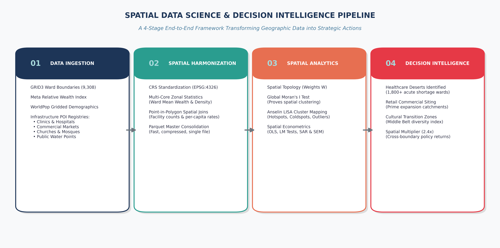
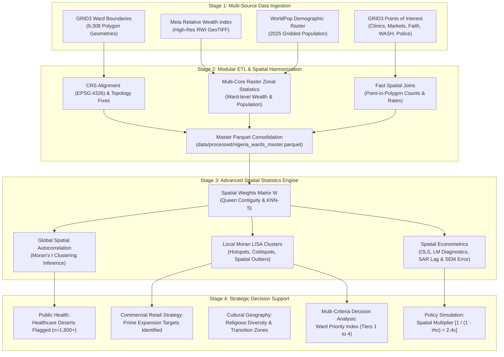

# Advanced Spatial Statistics
### *A Class on Theory and Practical Application*

[](https://www.python.org/downloads/)
[](https://geopandas.org/)
[](https://pysal.org/)
[](https://sammygis.github.io/dsn_advanced_spatial_stats/)
[](https://sammygis.github.io/dsn_advanced_spatial_stats/)
[](https://opensource.org/licenses/MIT)

---

## 1. Why Spatial Statistics in the Real World?

Traditional statistical methods and data science pipelines operate under the assumption of **independent and identically distributed ($i.i.d.$) observations**—the assumption that what happens in one village, ward, or neighborhood is completely independent of its neighbors. In reality, human settlements, economic commerce, disease vectors, and infrastructural access do not stop at administrative boundaries.

When public institutions and private corporations make strategic decisions based on state or national averages, they fall victim to three major fallacies:

1. **The Fallacy of the Average:** A state or province can appear "moderately wealthy" or "well-served by healthcare" on paper, while masking extreme internal inequality—such as affluent metropolitan centers sitting beside vast rural "healthcare deserts" where hundreds of thousands of citizens have zero access to clinics.
2. **The Spillover Blindspot (Tobler's First Law):** *"Everything is related to everything else, but near things are more related than distant things"* (Waldo Tobler, 1970). Investing in a major regional hospital, agricultural market, or road corridor in one ward creates positive spatial externalities (spillovers) across neighboring wards. Standard regressions dismiss this as unexplainable noise; **spatial econometrics explicitly models and quantifies it**.
3. **The Capital Misallocation Trap:** Deploying bank branches, supermarket retail stores, or drilling water boreholes without spatial intelligence leads to capital waste: saturating already competitive clusters while completely missing high-demand, underserved communities.

### 1.1 The Core Objective
This curriculum bridges the gap between **raw Earth Observation (EO) data** (high-resolution satellite-derived asset wealth, gridded population rasters) and **on-the-ground operational decisions**. By analyzing all **9,308 administrative wards in Nigeria**, students master how spatial statistics answers critical questions across diverse spheres of national life:
- **Where are the most urgent healthcare deserts?** (Wards with $>17,000$ residents and zero registered clinics).
- **Where are prime, untapped consumer retail catchments?** (Wards with high relative wealth but low commercial market density).
- **How do religious and civic institutions sort geographically?** (Mapping cultural cohesion and Shannon Entropy diversity zones).
- **How unequal is clean water infrastructure?** (Lorenz inequality curves and Gini coefficients).
- **What is the true economic multiplier of public investments?** (Spatial Lag SAR models decomposing direct vs. indirect spillover effects).

---

## 2. The Superpower of Spatial Statistics: Exploratory Spatial Data Analysis (ESDA) for Pattern Discovery

Why is spatial statistics so exceptionally powerful for exploratory analysis? 

Traditional non-spatial data exploration relies on **summary metrics (mean, median, standard deviation)**, **histograms**, and **correlation matrices**. These tools operate in "feature space" and completely discard geographic coordinates and spatial relationships:

```
Traditional EDA:  [Values] ───────► Summary Stats (Mean, SD) ──► BLIND to geographic arrangement
Spatial EDA:      [Values + Space] ─► Moran's I + LISA Maps  ──► UNLOCKS hidden clusters & anomalies
```

### 2.1 What Traditional Exploratory Data Analysis (EDA) Misses
- **Geographic Blindness:** You can shuffle the locations of 9,308 Nigerian wards randomly across the map, and the dataset's histogram, mean, and standard deviation will remain **100% identical**. Traditional EDA cannot tell whether poverty is randomly scattered or concentrated in vast regional belts.
- **Hidden Structural Regimes:** A single national correlation coefficient ($r = 0.45$) can conceal that the relationship between healthcare facilities and population is strongly positive in the South, but non-existent or reversed in remote Sahelian border areas.
- **Inability to Detect Local Spatial Anomalies:** Standard outlier detection (e.g. Tukey boxplots or $z$-scores $> 3$) only finds values that are globally extreme across the entire country. It completely misses **spatial outliers**—such as an affluent commercial ward surrounded by severe poverty, or an impoverished rural pocket inside a wealthy metropolitan corridor.

### 2.2 What Exploratory Spatial Data Analysis (ESDA) Unlocks
1. **Hypothesis-Free Pattern Discovery:** ESDA allows analysts to detect statistically significant geographic structures *before* formulating complex parametric equations.
2. **Global Spatial Autocorrelation (Moran's $I$):** Statistically proves whether an observed map pattern is genuine clustering or mere random chance ($p < 0.001$).
3. **Local Indicators of Spatial Association (Anselin LISA $I_i$):** Pinpoints the exact coordinates of:
   - **Hotspots ($HH$):** Statistically robust clusters of high values (e.g., concentrated wealth in Lagos and Abuja).
   - **Coldspots ($LL$):** Entrenched structural deprivation zones requiring targeted social interventions.
   - **Spatial Outliers ($HL$ & $LH$):** Regional economic engines ("Islands of Wealth") and underserved pockets within affluent zones ("Opportunity Sinks").
4. **Spatial Heterogeneity & Boundary Regimes:** Reveals non-stationary processes across state borders, river basins, and agro-ecological zones.

In short, **spatial statistics transforms raw geodata into structured pattern intelligence**, enabling decision-makers to see the structural geography that standard data science leaves invisible.

---

## 3. 10 Real-World Strategic Sectoral Applications

Every sector begins with an operational question. Spatial statistics provides the empirical answer:

```
┌─────────────────────────────────────────────────────────────────────────────────────────────────────────┐
│                           10 APPLIED SECTORAL DECISION INTELLIGENCE ENGINES                             │
├──────────────────────────┬──────────────────────────────────────────┬───────────────────────────────────┤
│ Sector                   │ Applied Spatial Statistical Method       │ Strategic Decision Output         │
├──────────────────────────┼──────────────────────────────────────────┼───────────────────────────────────┤
│ 1. Public Health         │ Binary Deserts Masking + Spatial Density │ 1,800+ Zero-Clinic Wards Flagged  │
│ 2. Disease Epidemiology  │ Spatial Lag SAR Model + Covariate Rates  │ Malaria Transmission Corridors    │
│ 3. Commercial Marketing  │ Bivariate Quadrant Catchment Analysis    │ High-Wealth, Low-Density Markets  │
│ 4. Water & WASH          │ Cumulative Lorenz Curves + Gini Index    │ Structural Clean Water Inequity   │
│ 5. Education Logistics   │ Facility-to-School-Age Dependency Ratio  │ Classroom Deficit Bottlenecks     │
│ 6. Cultural Geography    │ Shannon Diversity Entropy ($H$)          │ Middle Belt Religious Pluralism   │
│ 7. Civic Security        │ Nearest-Neighbor Euclidean Distance      │ Policing & Security Dark Zones    │
│ 8. Governance & Voting   │ Population Centroids + Catchment Buffers │ Polling Unit Logistics & Access   │
│ 9. Wealth & Inequality   │ Anselin Local Moran LISA ($I_i$)         │ Affluence Hotspots vs. Coldspots  │
│ 10. Capital Allocation   │ Multi-Criteria Decision Analysis (MCDA)  │ Ward Priority Index (Tiers 1-4)   │
└──────────────────────────┴──────────────────────────────────────────┴───────────────────────────────────┘
```

1. **Public Health & Healthcare Deserts:** Cross-referencing gridded population with registered clinics identifies wards with $>17,000$ residents and zero primary health facilities, directing mobile clinic routes.
2. **Malaria & Disease Epidemiology:** Quantifying how ambient climate and spatial neighborhood proximity drive parasite prevalence ($PfPR$) rates.
3. **Commercial Retail & Geomarketing:** Segmenting wards into wealth vs. market density quadrants isolates **Tier 2 (Prime Expansion Targets)** for supermarket chains and fintech agency banking.
4. **Water, Sanitation & Hygiene (WASH):** Calculating Lorenz curves reveals extreme spatial inequality ($Gini \approx 0.72$) in functional borehole infrastructure.
5. **Educational Infrastructure:** Evaluating ward school counts against school-age demographic cohorts (ages 5–14) to pinpoint severe classroom shortages.
6. **Cultural Geography & Cohesion:** Mapping faith institution ratios and Shannon Diversity Entropy reveals cultural sorting and transition zones across the Middle Belt.
7. **Civic Safety & Security:** Measuring spatial access to police stations to highlight vulnerable rural zones lacking emergency response coverage.
8. **Electoral Demographics & Governance:** Ward-level population clustering enables transparent boundary delimitation and equitable ballot distribution.
9. **Macro-Wealth Inequality:** Anselin LISA analysis identifies statistically significant affluence clusters (Lagos, Abuja, Port Harcourt) versus structural poverty traps.
10. **Multi-Sector Capital Allocation:** A composite Ward Priority Index (WPI) synthesizes health deficits, water poverty, and population pressure into four actionable investment tiers.

---

## 4. End-to-End Methodology Architecture

The diagram below illustrates how raw Earth Observation rasters, administrative boundaries, and infrastructure registries are ingested, cleaned, spatially harmonized, and modeled through our spatial statistical engine:





---

## 5. Class Lab Setup & Execution Guide

### 5.1 System Requirements & Environment Setup
Ensure you have Python 3.10, 3.11, or 3.12 installed:

```bash
# Clone the repository
git clone https://github.com/SammyGIS/dsn_advanced_spatial_stats.git
cd dsn_advanced_spatial_stats

# Create virtual environment
python -m venv .venv

# Activate environment
# On Windows (PowerShell):
.venv\Scripts\Activate.ps1
# On macOS / Linux:
source .venv/bin/activate

# Install core geospatial dependencies
pip install --upgrade pip
pip install -r requirements.txt
```

### 5.2 Running the Class Notebook
Launch JupyterLab or open the project folder in VS Code:

```bash
jupyter lab
```

Open `notebooks/spatial_statistics_use_cases.ipynb`. Each use case states a problem and a hypothesis, compares the aspatial approach with the spatial statistics method, runs the code on the class ward data, and interprets the results.

### 5.3 Rebuilding the Slides, Technical Note & Figures

The site in `docs/` is prebuilt. The build scripts live on the **`template`** branch; fetch them into a local `scripts/` folder first (it is git-ignored on `main`):

```bash
git checkout template -- scripts && git restore --staged scripts
```

```bash
# Regenerate publication figures
python scripts/export_publication_figures.py

# Add real ward-level malaria prevalence (Malaria Atlas Project) to the master dataset
python scripts/add_malaria_pfpr.py

# Build and execute the class notebook, then export its paged HTML view
cd scripts && python build_use_case_notebook.py --execute && cd ..

# Regenerate the GWR slope map (slides) and LISA real-boundary figure (Technical Note)
python scripts/export_gwr_map.py
python scripts/export_lisa_neighbourhoods.py

# Rebuild the Technical Note (docs/technical_notes.html)
cd scripts && python build_technical_notes.py && cd ..

# Rebuild the class slides and portal (docs/index.html, docs/presentation.html)
python scripts/build_dsn_presentation.py
```

---

## 6. Data Sources & Attributions

All datasets used in this framework originate from reputable global geospatial and development data repositories:

| Data Layer | Source Organization | Resolution / Scope | Direct URL |
| :--- | :--- | :--- | :--- |
| **Ward Administrative Boundaries** | GRID3 Nigeria | 9,308 Polygon Boundaries | [data.grid3.gov.ng](https://data.grid3.gov.ng/) |
| **Points of Interest (Health, Markets, WASH, Faith, Police)** | GRID3 Nigeria | National Point Registries | [data.grid3.gov.ng](https://data.grid3.gov.ng/) |
| **Relative Wealth Index (RWI)** | Meta Data for Good & UC Berkeley | 2.4 km High-Resolution Raster | [dataforgood.facebook.com](https://dataforgood.facebook.com/) |
| **Gridded Population & Demographics** | WorldPop Project | 100m Constrained Rasters (2025) | [worldpop.org](https://www.worldpop.org/) |
| **Malaria Parasite Rate ($PfPR_{2-10}$, 2025)** | Malaria Atlas Project (MAP), release 2026-08 | ~5 km raster, averaged per ward (`scripts/add_malaria_pfpr.py`) | [malariaatlas.org](https://malariaatlas.org/) |

---

## 7. Citation & Academic Use

If you use this curriculum, code, or decision support framework in your teaching, coursework, research publications, or consulting engagements, please cite:

```bibtex
@misc{nigeria_spatial_statistics_masterclass_2026,
  author = {Adedoyin, Samuel},
  title = {Advanced Spatial Statistics: Theory and Practical Application},
  year = {2026},
  publisher = {GitHub},
  howpublished = {\url{https://github.com/SammyGIS/dsn_advanced_spatial_stats}}
}
```

Distributed under the **MIT License**.
