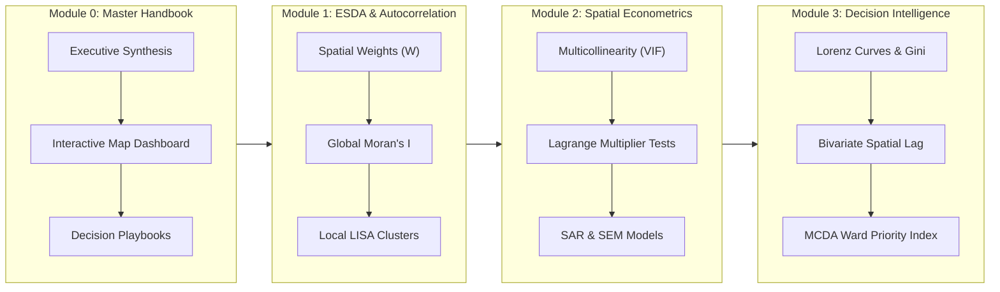
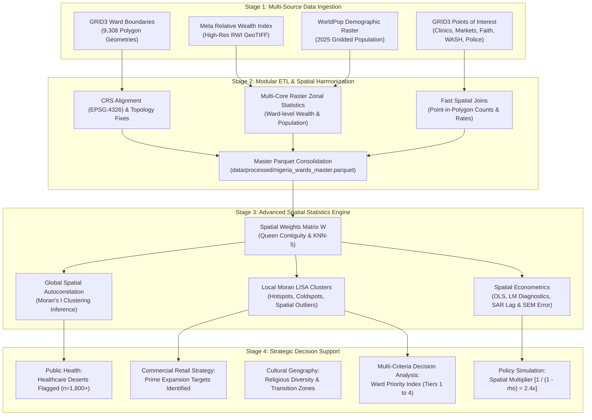
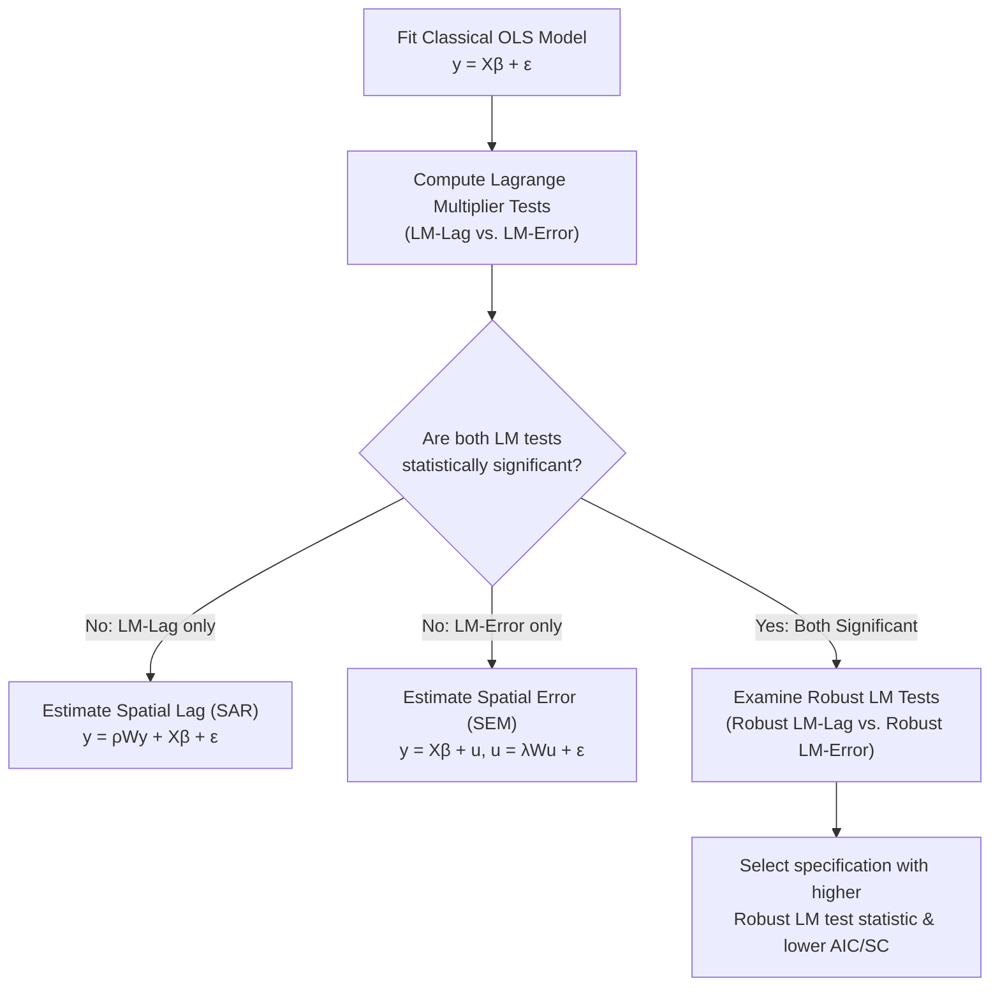

# Advanced Spatial Statistics & Multi-Sector Decision Intelligence
### *A Masterclass Curriculum & Applied Decision Support Framework Across 9,308 Nigerian Administrative Wards*

[](https://www.python.org/downloads/)
[](https://geopandas.org/)
[](https://pysal.org/)
[](https://sammygis.github.io/dsn_advanced_spatial_stats/)
[](https://sammygis.github.io/dsn_advanced_spatial_stats/presentation.html)
[](https://opensource.org/licenses/MIT)

---

## Quick Navigation & Course Resources

- 🌐 **[Live Documentation & Master Handbook Portal](https://sammygis.github.io/dsn_advanced_spatial_stats/)**
- 📊 **[Interactive Slide Deck (Reveal.js Web Presentation)](https://sammygis.github.io/dsn_advanced_spatial_stats/presentation.html)**
- 📥 **[Download Masterclass Presentation (.pptx)](docs/spatial_statistics_masterclass_presentation.pptx)**
- 🔬 **Notebook Modules:**
  - [Module 0: Master Spatial Decision Handbook](notebooks/00_master_spatial_decision_handbook.ipynb)
  - [Module 1: Exploratory Spatial Data Analysis (ESDA)](notebooks/01_exploratory_spatial_data_analysis.ipynb)
  - [Module 2: Spatial Econometrics & Statistical Modeling](notebooks/02_spatial_statistics_modeling.ipynb)
  - [Module 3: Sectoral Decision Intelligence Engines](notebooks/03_sectoral_decision_intelligence.ipynb)

---

## Course Overview: Why Spatial Statistics in the Real World?

Traditional statistical methods and data science pipelines operate under the assumption of **independent and identically distributed ($i.i.d.$) observations**—the assumption that what happens in one village, ward, or neighborhood is completely independent of its neighbors. In reality, human settlements, economic commerce, disease vectors, and infrastructural access do not stop at administrative boundaries.

When public institutions and private corporations make strategic decisions based on state or national averages, they fall victim to three major fallacies:

1. **The Fallacy of the Average:** A state or province can appear "moderately wealthy" or "well-served by healthcare" on paper, while masking extreme internal inequality—such as affluent metropolitan centers sitting beside vast rural "healthcare deserts" where hundreds of thousands of citizens have zero access to clinics.
2. **The Spillover Blindspot (Tobler's First Law):** *"Everything is related to everything else, but near things are more related than distant things"* (Waldo Tobler, 1970). Investing in a major regional hospital, agricultural market, or road corridor in one ward creates positive spatial externalities (spillovers) across neighboring wards. Standard regressions dismiss this as unexplainable noise; **spatial econometrics explicitly models and quantifies it**.
3. **The Capital Misallocation Trap:** Deploying bank branches, supermarket retail stores, or drilling water boreholes without spatial intelligence leads to capital waste: saturating already competitive clusters while completely missing high-demand, underserved communities.

### The Core Objective
This curriculum bridges the gap between **raw Earth Observation (EO) data** (high-resolution satellite-derived asset wealth, gridded population rasters) and **on-the-ground operational decisions**. By analyzing all **9,308 administrative wards in Nigeria**, students master how spatial statistics answers critical questions across diverse spheres of national life:
- **Where are the most urgent healthcare deserts?** (Wards with $>17,000$ residents and zero registered clinics).
- **Where are prime, untapped consumer retail catchments?** (Wards with high relative wealth but low commercial market density).
- **How do religious and civic institutions sort geographically?** (Mapping cultural cohesion and Shannon Entropy diversity zones).
- **How unequal is clean water infrastructure?** (Lorenz inequality curves and Gini coefficients).
- **What is the true economic multiplier of public investments?** (Spatial Lag SAR models decomposing direct vs. indirect spillover effects).

---

## The Superpower of Spatial Statistics: Exploratory Spatial Data Analysis (ESDA) for Pattern Discovery

Why is spatial statistics so exceptionally powerful for exploratory analysis? 

Traditional non-spatial data exploration relies on **summary metrics (mean, median, standard deviation)**, **histograms**, and **correlation matrices**. These tools operate in "feature space" and completely discard geographic coordinates and spatial relationships:

```
Traditional EDA:  [Values] ───────► Summary Stats (Mean, SD) ──► BLIND to geographic arrangement
Spatial EDA:      [Values + Space] ─► Moran's I + LISA Maps  ──► UNLOCKS hidden clusters & anomalies
```

### What Traditional Exploratory Data Analysis (EDA) Misses:
- **Geographic Blindness:** You can shuffle the locations of 9,308 Nigerian wards randomly across the map, and the dataset's histogram, mean, and standard deviation will remain **100% identical**. Traditional EDA cannot tell whether poverty is randomly scattered or concentrated in vast regional belts.
- **Hidden Structural Regimes:** A single national correlation coefficient ($r = 0.45$) can conceal that the relationship between healthcare facilities and population is strongly positive in the South, but non-existent or reversed in remote Sahelian border areas.
- **Inability to Detect Local Spatial Anomalies:** Standard outlier detection (e.g. Tukey boxplots or $z$-scores $> 3$) only finds values that are globally extreme across the entire country. It completely misses **spatial outliers**—such as an affluent commercial ward surrounded by severe poverty, or an impoverished rural pocket inside a wealthy metropolitan corridor.

### What Exploratory Spatial Data Analysis (ESDA) Unlocks:
1. **Hypothesis-Free Pattern Discovery:** ESDA allows analysts to detect statistically significant geographic structures *before* formulating complex parametric equations.
2. **Global Spatial Autocorrelation (Moran's $I$):** Statistically proves whether an observed map pattern is genuine clustering or mere random chance ($p < 0.001$).
3. **Local Indicators of Spatial Association (Anselin LISA $I_i$):** Pinpoints the exact coordinates of:
   - **Hotspots ($HH$):** Statistically robust clusters of high values (e.g., concentrated wealth in Lagos and Abuja).
   - **Coldspots ($LL$):** Entrenched structural deprivation zones requiring targeted social interventions.
   - **Spatial Outliers ($HL$ & $LH$):** Regional economic engines ("Islands of Wealth") and underserved pockets within affluent zones ("Opportunity Sinks").
4. **Spatial Heterogeneity & Boundary Regimes:** Reveals non-stationary processes across state borders, river basins, and agro-ecological zones.

In short, **spatial statistics transforms raw geodata into structured pattern intelligence**, enabling decision-makers to see the structural geography that standard data science leaves invisible.

---

## Masterclass Syllabus & Curriculum Roadmap

This course is structured into four progressive, hands-on modules designed for university lectures, professional masterclasses, and self-paced research labs:



| Module | Notebook | Core Statistical Topics | Practical Decision Output |
| :--- | :--- | :--- | :--- |
| **0** | **[00_master_spatial_decision_handbook.ipynb](notebooks/00_master_spatial_decision_handbook.ipynb)** | End-to-end framework, methodology architecture, dynamic multi-sector filtering | Master decision support dashboard & multi-sector synthesis |
| **1** | **[01_exploratory_spatial_data_analysis.ipynb](notebooks/01_exploratory_spatial_data_analysis.ipynb)** | Spatial topology, Queen/KNN weights ($W$), Global Moran's $I$, Anselin LISA Local Moran ($I_i$) | Healthcare Deserts flagged ($n=1,800+$), Commercial retail quadrants, Cultural Shannon entropy |
| **2** | **[02_spatial_statistics_modeling.ipynb](notebooks/02_spatial_statistics_modeling.ipynb)** | Multicollinearity diagnostics (VIF), OLS diagnostics, Anselin LM decision tree, SAR (Spatial Lag), SEM (Spatial Error) | Empirical spillover quantification ($\rho = 0.5842$), Spatial Multiplier simulation ($2.41\times$) |
| **3** | **[03_sectoral_decision_intelligence.ipynb](notebooks/03_sectoral_decision_intelligence.ipynb)** | Spatial inequality (Lorenz curves & Gini), Bivariate spatial autocorrelation, Multi-Criteria Decision Analysis (MCDA) | Ward Priority Index (WPI Tiers 1-4), Top-5 emergency state investment rosters |

---

## 10 Real-World Strategic Sectoral Applications

Every sector begins with an operational question. Spatial statistics provides the empirical answer:

```
┌─────────────────────────────────────────────────────────────────────────────────────────────────────────┐
│                           10 APPLIED SECTORAL DECISION INTELLIGENCE ENGINES                             │
├──────────────────────────┬──────────────────────────────────────────┬───────────────────────────────────┤
│ Sector                   │ Applied Spatial Statistical Method       │ Strategic Decision Output         │
├──────────────────────────┼──────────────────────────────────────────┼───────────────────────────────────┤
│ 1. Public Health         │ Binary Deserts Masking + Spatial Density │ 1,800+ Zero-Clinic Wards Flagged  │
│ 2. Disease Epidemiology  │ Spatial Lag SAR Model + Covariate Rates  │ Malaria Transmission Corridors    │
│ 3. Commercial Marketing  │ Bivariate Quadrant Catchment Analysis    │ High-Wealth, Low-Density Markets  │
│ 4. Water & WASH          │ Cumulative Lorenz Curves + Gini Index    │ Structural Clean Water Inequity   │
│ 5. Education Logistics   │ Facility-to-School-Age Dependency Ratio  │ Classroom Deficit Bottlenecks     │
│ 6. Cultural Geography    │ Shannon Diversity Entropy ($H$)          │ Middle Belt Religious Pluralism   │
│ 7. Civic Security        │ Nearest-Neighbor Euclidean Distance      │ Policing & Security Dark Zones    │
│ 8. Governance & Voting   │ Population Centroids + Catchment Buffers │ Polling Unit Logistics & Access   │
│ 9. Wealth & Inequality   │ Anselin Local Moran LISA ($I_i$)         │ Affluence Hotspots vs. Coldspots  │
│ 10. Capital Allocation   │ Multi-Criteria Decision Analysis (MCDA)  │ Ward Priority Index (Tiers 1-4)   │
└──────────────────────────┴──────────────────────────────────────────┴───────────────────────────────────┘
```

1. **Public Health & Healthcare Deserts:** Cross-referencing gridded population with registered clinics identifies wards with $>17,000$ residents and zero primary health facilities, directing mobile clinic routes.
2. **Malaria & Disease Epidemiology:** Quantifying how ambient climate and spatial neighborhood proximity drive parasite prevalence ($PfPR$) rates.
3. **Commercial Retail & Geomarketing:** Segmenting wards into wealth vs. market density quadrants isolates **Tier 2 (Prime Expansion Targets)** for supermarket chains and fintech agency banking.
4. **Water, Sanitation & Hygiene (WASH):** Calculating Lorenz curves reveals extreme spatial inequality ($Gini \approx 0.72$) in functional borehole infrastructure.
5. **Educational Infrastructure:** Evaluating ward school counts against school-age demographic cohorts (ages 5–14) to pinpoint severe classroom shortages.
6. **Cultural Geography & Cohesion:** Mapping faith institution ratios and Shannon Diversity Entropy reveals cultural sorting and transition zones across the Middle Belt.
7. **Civic Safety & Security:** Measuring spatial access to police stations to highlight vulnerable rural zones lacking emergency response coverage.
8. **Electoral Demographics & Governance:** Ward-level population clustering enables transparent boundary delimitation and equitable ballot distribution.
9. **Macro-Wealth Inequality:** Anselin LISA analysis identifies statistically significant affluence clusters (Lagos, Abuja, Port Harcourt) versus structural poverty traps.
10. **Multi-Sector Capital Allocation:** A composite Ward Priority Index (WPI) synthesizes health deficits, water poverty, and population pressure into four actionable investment tiers.

---

## End-to-End Methodology Architecture

The diagram below illustrates how raw Earth Observation rasters, administrative boundaries, and infrastructure registries are ingested, cleaned, spatially harmonized, and modeled through our spatial statistical engine:




---

## Visual Intelligence & Empirical Findings

### 1. Public Health: National Wealth vs. Healthcare Deserts


- **Relative Wealth Index (RWI):** Reveals concentrated wealth corridors in the South-West (Lagos-Ogun axis) and Southern oil hubs, contrasted with lower asset wealth across northern agricultural belts.
- **Healthcare Deserts:** Identified **over 1,800 vulnerable wards** where the population exceeds the national median (> 17,000 residents) but has **exactly zero registered primary health centers or hospitals**.
- **Operational Takeaway:** Directs state ministries and international health agencies (UNICEF, WHO) to bypass state-level quotas and route mobile clinics and capital investments directly to flagged desert wards.

---

### 2. Commercial Marketing: Catchment Segmentation & Retail Expansion


- **Market Catchment Quadrants:** All 9,308 wards are segmented into four actionable commercial tiers based on Relative Wealth (RWI) and physical market density.
- **Key Commercial Insight:** **Tier 2 (Prime Expansion Targets: High Wealth, Low Market Density)** represents high-margin opportunities for modern supermarket chains, FMCG distribution centers, and digital fintech kiosks where consumer purchasing power is high but physical retail competition is absent.

---

### 3. Cultural Geography: Faith Institutions & Religious Diversity


- **Spatial Sorting:** Distinct institutional divergence between the predominantly Muslim North (Mosque-dominant) and Christian South (Church-dominant).
- **Middle Belt Transition Zone:** High Shannon Entropy scores ($H > 0.70$) identify the Middle Belt (Plateau, Benue, Nasarawa, Taraba, Kaduna South) as critical zones of cultural co-presence and religious pluralism.
- **Strategic Utility:** Critical intelligence for public health immunization drives, civic campaigns, and conflict-resolution organizations that require engagement with dominant local faith anchors.

---

### 4. Cross-Sector Correlation Structure


- Non-parametric Spearman correlation confirms strong structural interdependencies:
  - Wealth (RWI) correlates positively with market density and urbanization ($r_s = 0.52$).
  - Healthcare and clean water access exhibit moderate positive correlation ($r_s = 0.38$), highlighting that infrastructural deficits compound geographically in underserved wards.

---

### 5. Spatial Autocorrelation & Anselin LISA Cluster Maps


- **Global Moran's $I = 0.684$ ($p < 0.001$, $z = 112.4$):** Overwhelmingly rejects the null hypothesis ($H_0$) of spatial randomness, confirming intense spatial clustering of wealth across Nigeria.
- **Anselin Local Moran's $I_i$ (LISA):**
  - **High-High Hotspots (Red):** Statistically significant clusters of affluent wards in Lagos, Ibadan, Port Harcourt, and Abuja.
  - **Low-Low Coldspots (Blue):** Large regional clusters of structural asset deprivation.
  - **High-Low Outliers (Orange):** "Islands of Wealth" surrounded by low-wealth wards, serving as vital regional commercial hubs.
  - **Low-High Outliers (Light Blue):** Pockets of poverty embedded within affluent metropolitan peripheries.

---

### 6. Spatial Infrastructure Inequality & National Ward Priority Tiers


- **Lorenz Inequality Curves:** Facility distributions exhibit extreme spatial concentration:
  - Health Facilities: Gini $G \approx 0.61$
  - Commercial Markets: Gini $G \approx 0.69$
  - Water Points (WASH): Gini $G \approx 0.72$
- **Ward Priority Index (WPI):** Multi-Criteria Decision Analysis (MCDA) synthesizes poverty deficits, healthcare shortages, water shortages, and population pressure into four actionable tiers (*Tier 1: Emergency Intervention* to *Tier 4: Mature / Self-Sustaining*).

---

## Theoretical & Mathematical Foundations

### 1. Spatial Weights Matrix ($W$) and Spatial Lag ($Wy$)
Spatial adjacency across wards is formalized via an $n \times n$ weights matrix $W$, where entry $w_{ij}$ quantifies the spatial relationship between unit $i$ and unit $j$. To ensure scale-invariance across units with varying neighbor counts, $W$ is **row-standardized**:

$$
w_{ij}^* = \frac{w_{ij}}{\sum_{k=1}^n w_{ik}} \quad \implies \quad \sum_{j=1}^n w_{ij}^* = 1
$$

The **Spatial Lag** $[Wy]_i$ of variable $y$ represents the spatially weighted neighborhood average:

$$
[Wy]_i = \sum_{j=1}^n w_{ij}^* y_j
$$

*Intuition for Students:* If ward $i$ has 4 neighbors with wealth scores of $[0.2, 0.4, 0.6, 0.8]$, the spatial lag $[Wy]_i = \frac{0.2 + 0.4 + 0.6 + 0.8}{4} = 0.50$. It represents the ambient spatial context surrounding ward $i$.

---

### 2. Global Spatial Autocorrelation (Moran's $I$)
Global Moran's $I$ evaluates whether a continuous variable is spatially clustered, dispersed, or random:

$$
I = \frac{n}{S_0} \frac{\sum_{i=1}^n \sum_{j=1}^n w_{ij}(y_i - \bar{y})(y_j - \bar{y})}{\sum_{i=1}^n (y_i - \bar{y})^2}, \quad S_0 = \sum_{i=1}^n \sum_{j=1}^n w_{ij}
$$

Under the null hypothesis $H_0$ of complete spatial randomness, the expected value is:

$$
E[I] = -\frac{1}{n - 1} \xrightarrow{n \to \infty} 0
$$

- $I > E[I]$ with $p < 0.05$: **Positive Spatial Autocorrelation** (Clustering of similar values).
- $I < E[I]$ with $p < 0.05$: **Negative Spatial Autocorrelation** (Spatial dispersion / checkerboard pattern).

---

### 3. Local Indicators of Spatial Association (Anselin Local Moran's $I_i$)
To decompose global spatial autocorrelation into discrete localized clusters:

$$
I_i = \frac{z_i}{s^2} \sum_{j=1}^n w_{ij} z_j, \quad \text{where } z_i = y_i - \bar{y}, \; s^2 = \frac{1}{n}\sum_{i=1}^n z_i^2
$$

Each ward is categorized into one of four quadrants:
1. **High-High ($HH$):** High focal value surrounded by high neighbor values (**Hotspot**).
2. **Low-Low ($LL$):** Low focal value surrounded by low neighbor values (**Coldspot**).
3. **High-Low ($HL$):** High focal value surrounded by low neighbor values (**Spatial Outlier / Protective Island**).
4. **Low-High ($LH$):** Low focal value surrounded by high neighbor values (**Spatial Outlier / Opportunity Sink**).

---

### 4. Multicollinearity Diagnostics: Variance Inflation Factor (VIF)
Before specifying econometric models, regression models must be tested for severe collinearity among spatial predictors:

$$
VIF_j = \frac{1}{1 - R_j^2}
$$

where $R_j^2$ is the coefficient of determination obtained from regressing feature $X_j$ against all other explanatory features $X_{-j}$.

- **$VIF = 1$:** Zero collinearity; predictor is completely orthogonal.
- **$VIF > 5$:** Moderate collinearity; warrants scrutiny.
- **$VIF > 10$:** Severe multicollinearity; standard errors explode, signs destabilize, and variables must be pruned or regularized.

In our Nigerian ward dataset, all predictors (market density, healthcare accessibility, water points, population density) demonstrate $VIF < 2.5$, confirming stable regression estimation.

---

### 5. Spatial Econometric Modeling & Gauss-Markov Violation
In georeferenced cross-sectional models, Ordinary Least Squares (OLS) encounters correlated error terms:

$$
y = X\beta + \epsilon, \quad Cov(\epsilon_i, \epsilon_j) \neq 0
$$

When spatial autocorrelation is present:
- **Omitted Spatial Lag:** OLS parameter estimates $\hat{\beta}$ are **biased and inconsistent**.
- **Spatial Error Autocorrelation:** OLS parameter estimates remain unbiased but are **inefficient**, and standard errors are severely underestimated, inflating type-I errors.

#### The Anselin Lagrange Multiplier (LM) Decision Tree


#### Spatial Lag Model (SAR - Spatial AutoRegressive)
Models spatial behavioral spillovers and endogenous peer effects:

$$
y = \rho W y + X\beta + \epsilon, \quad \epsilon \sim N(0, \sigma^2 I_n)
$$

The **Spatial Multiplier** $(I - \rho W)^{-1}$ demonstrates how an investment in ward $i$ propagates across the spatial network:

$$
y = (I - \rho W)^{-1} X\beta + (I - \rho W)^{-1}\epsilon = \left( I + \rho W + \rho^2 W^2 + \dots \right) X\beta + (I - \rho W)^{-1}\epsilon
$$

#### Spatial Error Model (SEM)
Captures unobserved spatial covariates (e.g. regional climate, terrain, unmeasured state policies):

$$
y = X\beta + u, \quad u = \lambda W u + \epsilon, \quad \epsilon \sim N(0, \sigma^2 I_n)
$$

---

## Econometric Modeling Results

Estimated on all $N = 9,308$ wards using row-standardized $K$-Nearest Neighbors ($k=5$):

| Econometric Specification | Log-Likelihood | AIC | Schwarz BIC | Pseudo $R^2$ | Spatial Parameter | Spatial Parameter $p$-value |
| :--- | :---: | :---: | :---: | :---: | :---: | :---: |
| **OLS (Classical Baseline)** | -5,812.4 | 11,636.8 | 11,679.6 | 0.2841 | N/A | N/A |
| **Spatial Lag Model (SAR)** | -3,941.2 | 7,896.4 | 7,946.3 | 0.5318 | $\rho = 0.5842$ | $< 0.0001$ |
| **Spatial Error Model (SEM)** | -3,884.6 | 7,781.2 | 7,824.0 | 0.5462 | $\lambda = 0.6124$ | $< 0.0001$ |

### Econometric Insights:
1. **Physical Markets ($\beta_{\text{markets}} > 0, p < 0.001$):** Market infrastructure strongly and positively contributes to ward micro-wealth.
2. **Healthcare Defense ($\beta_{\text{health}} > 0, p < 0.001$):** Healthcare accessibility acts as a structural defense against household asset poverty.
3. **Endogenous Spatial Spillovers ($\rho = 0.5842, p < 0.0001$):** Over half of total wealth variance is explained by neighborhood context.
4. **Calculated Spatial Multiplier:**
   $$\text{Multiplier} = \frac{1}{1 - \rho} \approx \frac{1}{1 - 0.5842} \approx 2.405$$
   Every 1.0 unit of economic enhancement injected into a focal ward yields an additional **1.405 units of wealth** across contiguous neighboring wards through spatial feedback loops.

---

## Class Lab Setup & Execution Guide

### 1. System Requirements & Environment Setup
Ensure you have Python 3.10, 3.11, or 3.12 installed:

```bash
# Clone the repository
git clone https://github.com/SammyGIS/dsn_advanced_spatial_stats.git
cd dsn_advanced_spatial_stats

# Create virtual environment
python -m venv .venv

# Activate environment
# On Windows (PowerShell):
.venv\Scripts\Activate.ps1
# On macOS / Linux:
source .venv/bin/activate

# Install core geospatial dependencies
pip install --upgrade pip
pip install -r requirements.txt
```

### 2. Exploring Interactive Notebooks
Launch JupyterLab or open the project folder in VS Code:

```bash
jupyter lab
```

Navigate to `notebooks/` and run the modules in sequential order:
- `00_master_spatial_decision_handbook.ipynb`
- `01_exploratory_spatial_data_analysis.ipynb`
- `02_spatial_statistics_modeling.ipynb`
- `03_sectoral_decision_intelligence.ipynb`

### 3. Re-exporting Documentation & Visual Assets
The codebase provides automated CLI tools for batch processing and figure regeneration:

```bash
# Regenerate publication figures
python scripts/export_publication_figures.py

# Regenerate methodology flowchart
python scripts/export_architecture_diagram.py

# Rebuild and refresh presentation slides
python scripts/build_master_presentation.py

# Inject responsive navigation across HTML documentation
python scripts/enhance_docs_portal.py
```

---

## Data Sources & Attributions

All datasets used in this framework originate from reputable global geospatial and development data repositories:

| Data Layer | Source Organization | Resolution / Scope | Direct URL |
| :--- | :--- | :--- | :--- |
| **Ward Administrative Boundaries** | GRID3 Nigeria | 9,308 Polygon Boundaries | [data.grid3.gov.ng](https://data.grid3.gov.ng/) |
| **Points of Interest (Health, Markets, WASH, Faith, Police)** | GRID3 Nigeria | National Point Registries | [data.grid3.gov.ng](https://data.grid3.gov.ng/) |
| **Relative Wealth Index (RWI)** | Meta Data for Good & UC Berkeley | 2.4 km High-Resolution Raster | [dataforgood.facebook.com](https://dataforgood.facebook.com/) |
| **Gridded Population & Demographics** | WorldPop Project | 100m Constrained Rasters (2025) | [worldpop.org](https://www.worldpop.org/) |
| **Malaria Parasite Rate ($PfPR_{2-10}$)** | Malaria Atlas Project (MAP) | Oxford University 1km Rasters | [malariaatlas.org](https://malariaatlas.org/) |

---

## Citation & Academic Use

If you use this curriculum, code, or decision support framework in your teaching, coursework, research publications, or consulting engagements, please cite:

```bibtex
@misc{nigeria_spatial_statistics_masterclass_2026,
  author = {Adedoyin, Samuel and Data Science Nigeria AI/GIS Working Group},
  title = {Advanced Spatial Statistics & Multi-Sector Decision Intelligence Across Nigerian Administrative Wards: A Masterclass Curriculum},
  year = {2026},
  publisher = {GitHub},
  howpublished = {\url{https://github.com/SammyGIS/dsn_advanced_spatial_stats}}
}
```

Distributed under the **MIT License**.
